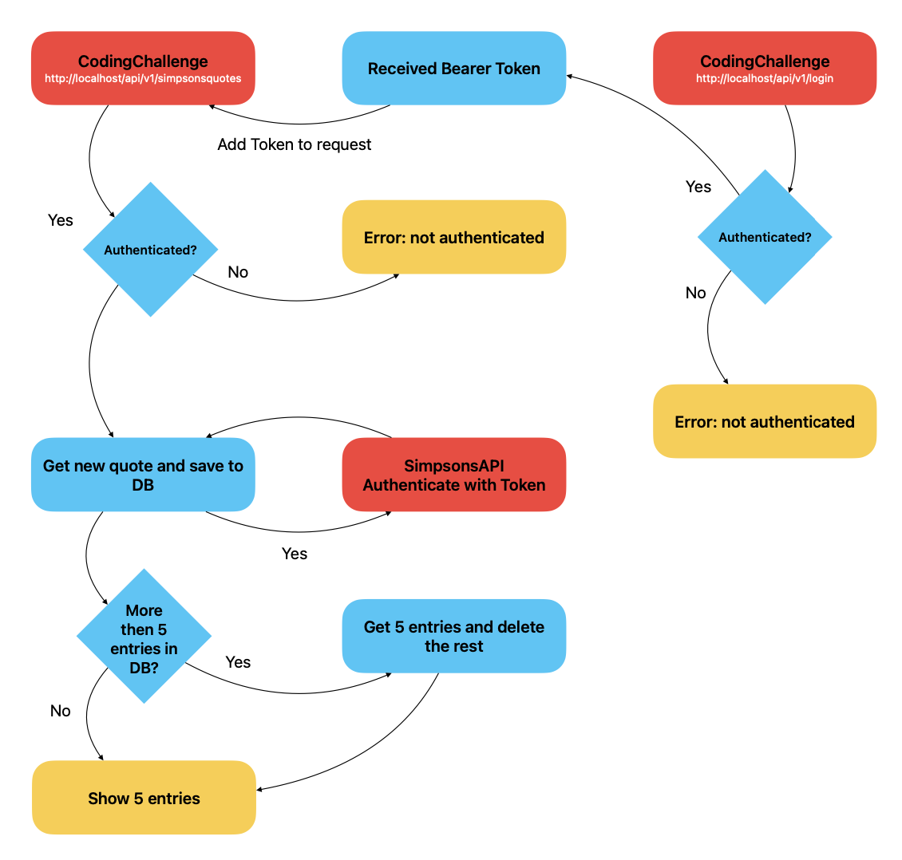

## HBCodingCallenge

### Installation 
#### Pre-requirements

 - git
 - docker-composer capable Docker installation (https://www.docker.com)

#### Installation Steps

1. Clone this repository
2. Rename the .env.demo to .env and adjust the variables to your requirements
3. In the root folder of the cloned project execute `./vendor/laravel/sail/bin/sail up`. This will install all needed images, volumes and containers via docker.   **_Note: The vendor folder is included in this project for comfort purposes, to prevent otherwise needed installations of php and composer._**   The database will also be seeded with some demo entries for the api credentials. If you don't change the demo seeding, everything should directly work.
4. Done! Please Check with docker if everything is working.

### Usage

#### Tools

 - phpMyAdmin, already installed via docker (http://localhost:8001)
 - Postman, you can find a prepared Postman Collection in the sourcecode `./postman/SimpsonQuotes.postman_collection.json`
 
#### What can it do?

For this demo, the api and it's capabilities are very limited. Right now you can only get up to 5 quotes and image links from the Simpsons API.

They will be returned in order of the datetime they were initially fetched from the Simpsons API (random quote), newest first.

After reaching a count of 5 in the database, the oldest quote will be deleted.

####  How to use it?

After opening Postman and importing the collection, you can find two endpoints to the API.

- Authenticate (http://localhost/api/v1/login)
- Retrieve Quotes (http://localhost/api/v1/simpsonsquotes)

Use the endpoints as described:

1. First you need to call the `Authenticate` endpoint to authenticate against the database. You will receive a Bearer Token, that needs to be used in the `Receive Quotes` call. If you did not changed the provided demo data, it should work as is. Otherwise go to the Body tab in Postman and adjust the values to your settings.
2. Copy the response token and insert it into the Authorization tab of the `Receive Quotes` entry. Select Bearer Token as the type and put in the string into the token field.
3. You can now send a request. With every request against the API endpoint you will receive a new quote and image link.  **_As described in Task C - Backend 2, there can be less than 5 entries until the full amount is reached._**

Have Fun!!!
